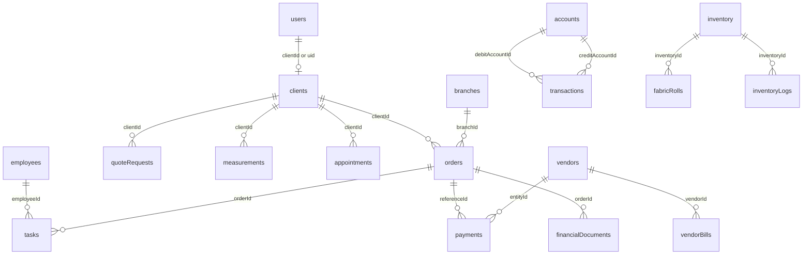

# Database Documentation

Database technology: Cloud Firestore.

Primary schema sources:

- `src/types.ts`
- `firebase-blueprint.json`
- `firestore.rules`

## Collections

| Collection | Purpose | Key Fields |
|---|---|---|
| `users` | Auth profile, role, permissions | `uid`, `email`, `role`, `permissions`, `clientId`, `employeeId`, `branchId` |
| `clients` | Customer records | `name`, `phone`, `email`, `address`, `measurements`, `householdId` |
| `households` | Shared family/group records | `name`, `primaryContactName`, `phone`, `address` |
| `measurements` | Versioned measurements | `clientId`, `version`, `measurements`, `recordedBy`, `date` |
| `orders` | Tailoring work orders | `clientId`, `branchId`, `items`, `status`, `totalAmount`, `paidAmount`, `auditTrail` |
| `tasks` | Production tasks | `orderId`, `employeeId`, `type`, `status` |
| `quoteRequests` | Bespoke quote inquiries | `clientId`, `garmentType`, `styleNotes`, `status`, `reviewNotes` |
| `appointments` | Scheduled visits | `clientId`, `type`, `status`, `startTime`, `endTime`, `assignedTo` |
| `inventory` | Stock items | `name`, `category`, `quantity`, `unit`, `minLevel`, `isRollTracked` |
| `fabricRolls` | Individual fabric rolls | `inventoryId`, `rollNumber`, `originalLength`, `remainingLength`, `status` |
| `inventoryLogs` | Inventory movements | `inventoryId`, `rollId`, `quantity`, `performedBy`, `timestamp` |
| `accounts` | Chart of accounts | `code`, `name`, `type`, `balance` |
| `transactions` | Journal entries | `amount`, `debitAccountId`, `creditAccountId`, `reference`, `type` |
| `financialDocuments` | Quotations/invoices/receipts | `type`, `amount`, `status`, `clientId`, `employeeId`, `orderId` |
| `payments` | Inbound/outbound payments | `amount`, `method`, `type`, `entityId`, `referenceId` |
| `employees` | Personnel records | `name`, `role`, `salary`, `phone`, `joinedAt` |
| `payrollRecords` | Salary history | `employeeId`, `month`, `netSalary`, `status`, `transactionId` |
| `vendors` | Supplier records | `name`, `category`, `balance`, `phone`, `address` |
| `vendorBills` | Procurement bills | `vendorId`, `amount`, `paidAmount`, `status`, `items` |
| `notifications` | User alerts | `userId`, `title`, `message`, `type`, `read` |
| `profileRequests` | Employee profile-change approvals | `userId`, `suggestedChanges`, `status` |
| `recurringTransactions` | Recurring ledger templates | `amount`, `frequency`, `nextDueDate`, `status` |
| `branches` | Business locations | `name`, `address`, `phone`, `manager`, `isActive` |
| `auditLogs` | System audit entries | `actorId`, `action`, `entityType`, `entityId`, `timestamp` |

## Relationships

## Indexes

No `firestore.indexes.json` was found. Composite indexes may be required for some query combinations at runtime.

## Data Integrity

Enforced:

- Firestore rules validate selected required fields and role access.
- Financial helper enforces positive ledger amount.
- Some flows use `writeBatch`.

Not found in codebase:

- Foreign keys.
- Soft-delete pattern.
- Server-side invariant enforcement.
- Emulator tests for rules.
