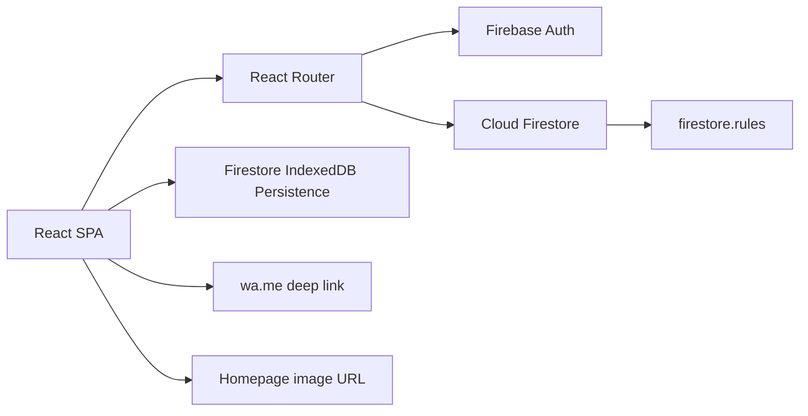
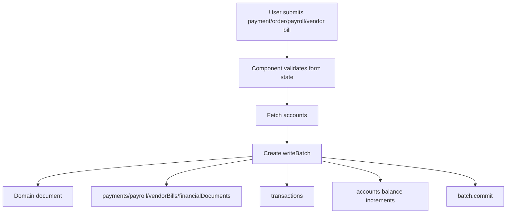
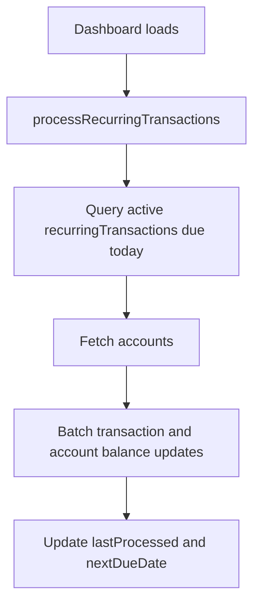
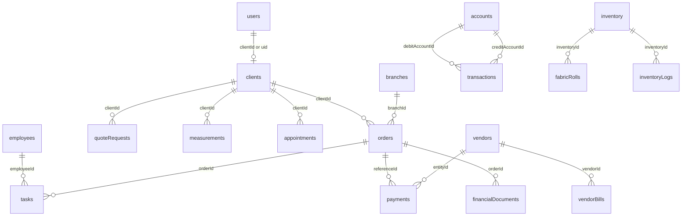

# Mermaid Diagrams

## System Architecture



## Request Lifecycle

```mermaid
flowchart TD
  A[Browser opens route] --> B[React Router in App.tsx]
  B --> C[UserProvider waits for Firebase Auth]
  C --> D[Load users/{uid} profile]
  D --> E{Role and route}
  E -->|public| H[Render Home]
  E -->|client| I[Render ClientDashboard or RequestQuote]
  E -->|admin/employee| J[Render AdminLayout and module]
  I --> K[Firestore read/write]
  J --> K
  K --> L[firestore.rules authorize]
  L --> M[onSnapshot/getDocs/updateDoc/writeBatch response]
```

## Financial Write Flow



## Recurring Transaction Flow



## Data Relationships



## Background Job Flow

Not found in codebase as a real worker/queue/scheduler. The closest implemented flow is the dashboard-triggered recurring transaction helper above.
